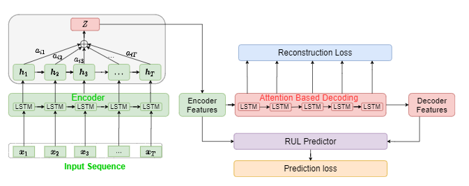

# Attention-based sequence to sequence model for machine remaining useful life prediction
#### *by: Mohamed Ragab, Zhenghua Chen, Min Wu,  Chee Keong Kwoh, Ruqiang Yan, and  Xiaoli Li*
#### Accepted for publication in Neurocomputing, Elseveir  (Impact Factor: 5.719).

# Abstract

Accurate estimation of remaining useful life (RUL) of industrial equipment can enable advanced maintenance schedules, increase equipment availability and reduce operational costs. However, existing deep learning methods for RUL prediction are not completely successful due to the following two reasons. First, relying on a single objective function to estimate the RUL will limit the learned representations and thus affect the prediction accuracy. Second, while longer sequences are more informative for modelling the sensor dynamics of equipment, existing methods are less effective to deal with very long sequences, as they mainly focus on the latest information. To address these two problems, we develop a novel attention-based sequence to sequence with auxiliary task (ATS2S) model. In particular, our model jointly optimizes both reconstruction loss to empower our model with predictive capabilities (by predicting next input sequence given current input sequence) and RUL prediction loss to minimize the difference between the predicted RUL and actual RUL. Furthermore, to better handle longer sequences, we employ the attention mechanism to focus on all the important input information during the training process. Finally, we propose a new dual-latent feature representation to integrate the encoder features and decoder hidden states, to capture rich semantic information in data. We conduct extensive experiments on four real datasets to evaluate the efficacy of the proposed method. Experimental results show that our proposed method can achieve superior performance over 13 state-of-the-art methods consistently.


### Dependencies
This code requires the following:
* python 2.\* or python 3.\*
* Pytorch v1.2+

### Data
The model performance is tested on NASA turbofan engines dataset [https://ti.arc.nasa.gov/tech/dash/groups/pcoe/prognostic-data-repository/#turbofan]. 

### Data Preprocessing
After downloading you can do the data preprocessing steps you can check this file `data_processing.py`

### Usage
To run the code, we have two main models, single working condition model `model_single_wk_data.py` and multiple working model  `model_multi_wk_data.py. The files will show the training results and then print the performance on test set. 

## Citation
If you found this work useful for you, please consider citing it.
```
@article{ragab2021attention,
  title={Attention-based sequence to sequence model for machine remaining useful life prediction},
  author={Ragab, Mohamed and Chen, Zhenghua and Wu, Min and Kwoh, Chee-Keong and Yan, Ruqiang and Li, Xiaoli},
  journal={Neurocomputing},
  volume={466},
  pages={58--68},
  year={2021},
  publisher={Elsevier}
```

## Contact
For any issues/questions regarding the paper or reproducing the results, please contact me.   
Mohamed Ragab    
School of Computer Science and Engineering (SCSE),   
Nanyang Technological University (NTU), Singapore.   
Email: mohamedr002{at}e.ntu.edu.sg   
